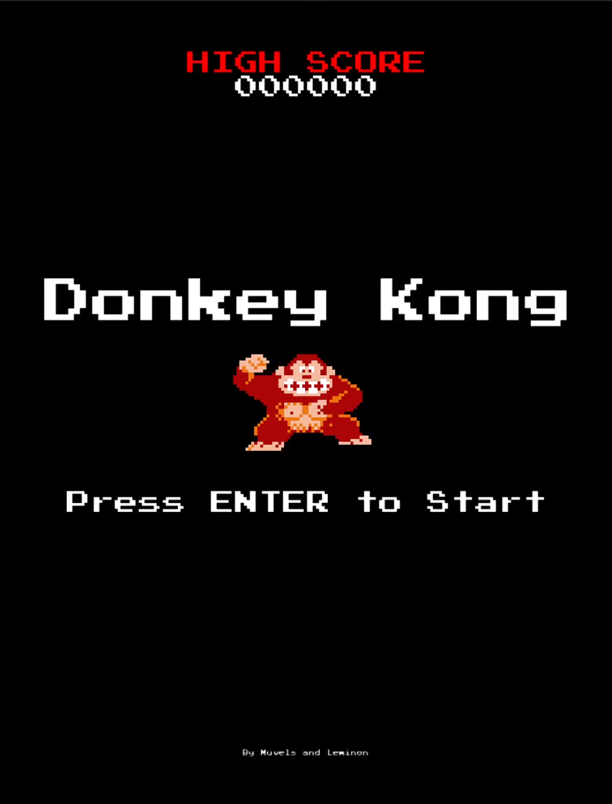
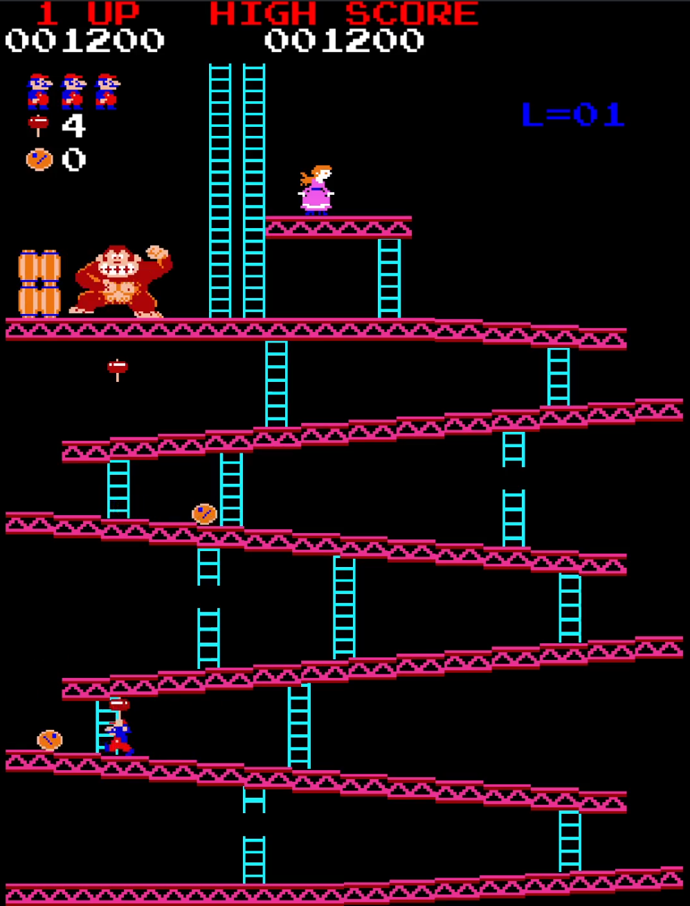
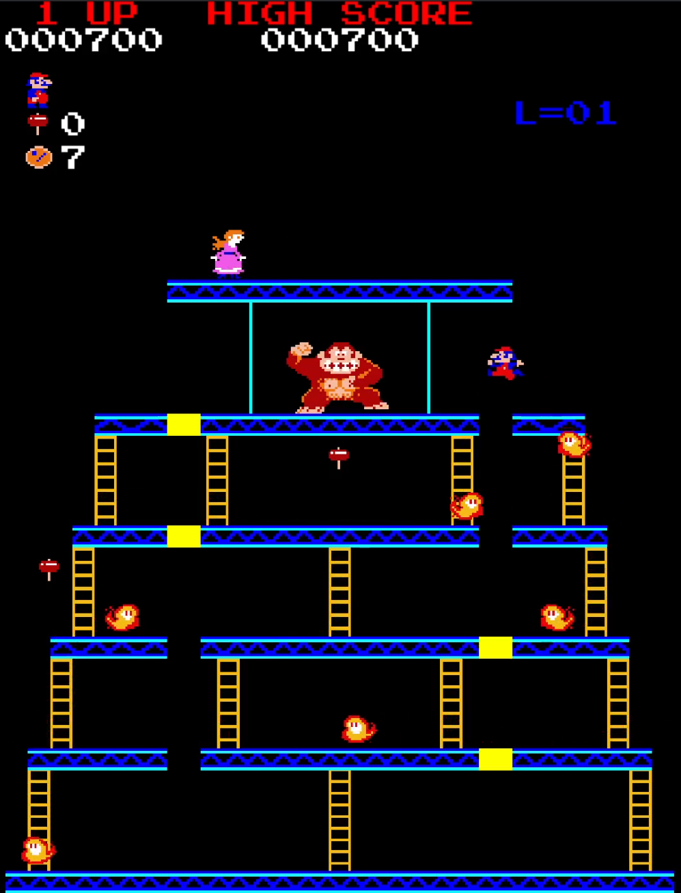

# Course and features of the game

Oh no! After Donkey Kong has escaped his cage and kidnapped his owner Jumpman's girlfriend Pauline, the gorilla climbs to the top of a construction site! Jumpman must rescue Pauline by following his pet monkey through different stages, each with its own unique challenges and obstacles. Will Jumpman be able to save Pauline from the clutches of Donkey Kong?

## General course of the game

After starting the game, you will see the title screen. Press Enter to start the game. You will then play two different stages in sequence (25m and 100m). After completing both of them successfully, the sequence will restart with increased difficulty. The level count in the top right shows the current iteration you are in. At the beginning, you have three lives (visible in the top left of the screen). On touching an enemy or obstacle, you will lose one life and have to restart the stage. The game ends after losing all three lives. You can gain score points in different ways, such as jumping over a barrel or using the hammer power-up. Your current score is shown in the top left and the highscore is visible in the top center.

## Stages

### 25m

In this stage, you have to reach the top by walking on girders and climbing ladders. Meanwhile, you have to watch out for barrels thrown by Donkey Kong that can roll down girders and ladders. You can grab a hammer power-up that allows you to destroy barrels for a limited amount of time. The stage is completed after climbing onto the top girder where Pauline is screaming for help. The speed of the barrels increases with each level.

### 100m

This stage features girders and ladders too. However, instead of reaching the top, you have to destroy all 8 yellow platforms by walking across them to bring Donkey Kong to his fall. Also, the stage is haunted by ghosts that will get in your way.

## Controls

| Key | Action |
|---|---|
| Left/Right Arrow | walk |
| Up/Down Arrow | climb |
| Space | jump |

## Features

* different stages
* increasing difficulty
* score points
* hammer power-up
* barrels and ghosts as obstacles
* textures and animations
